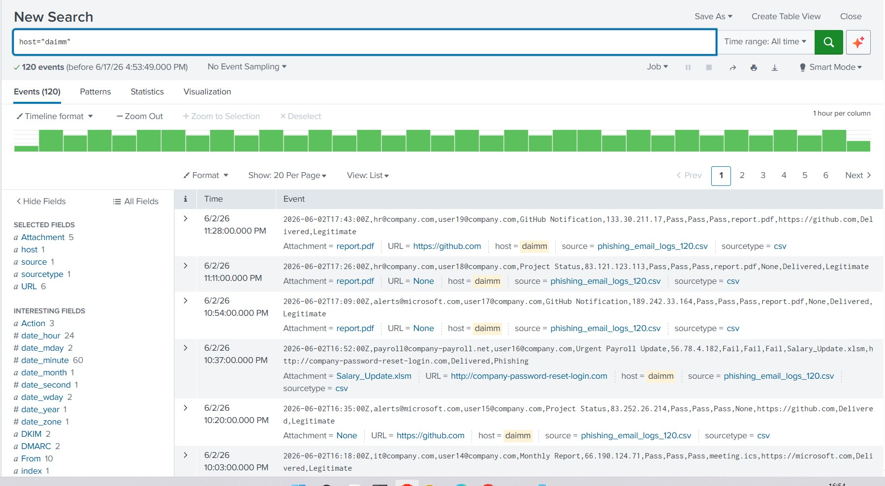
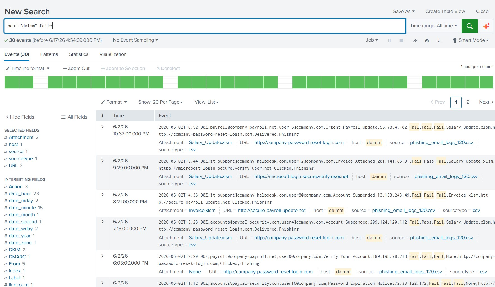
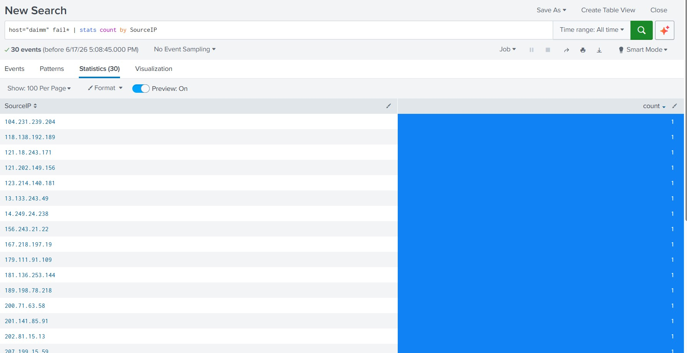
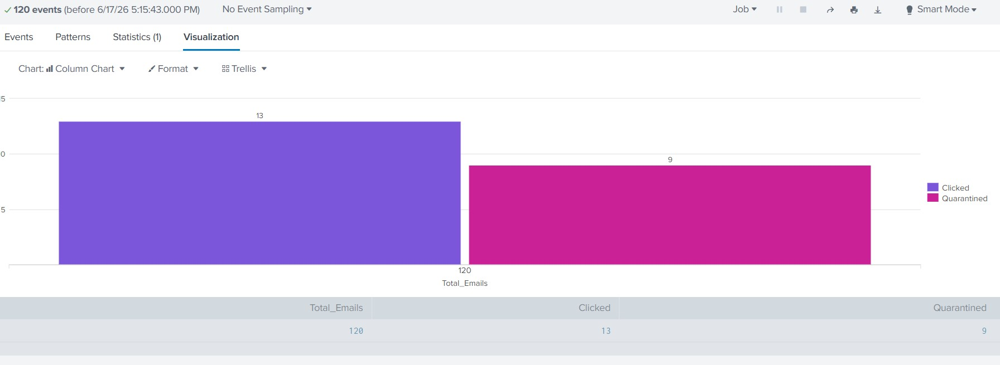
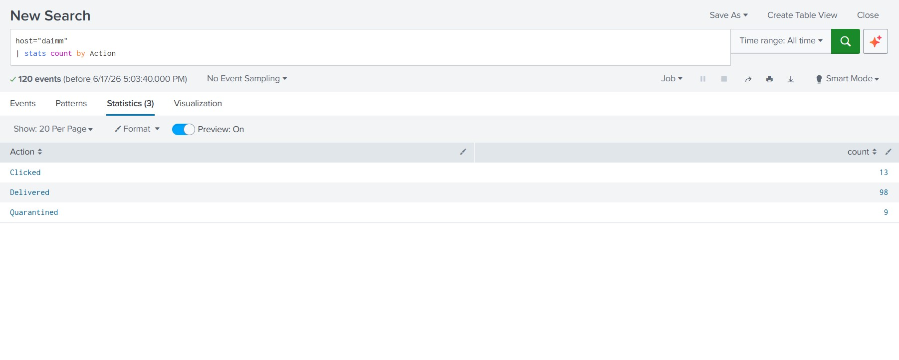

# 🛡️ Project: Phishing Campaign Threat Hunting & Response

## 🚀 Executive Summary
This project demonstrates end-to-end threat hunting within a Splunk environment to identify, analyze, and neutralize a targeted phishing campaign. By leveraging authentication protocol failures as a detection vector, I successfully mapped a distributed botnet infrastructure and performed an impact analysis on user behavior.

---

## 🔍 Investigation Workflow

### 1. Baseline & Scoping
I established a baseline by analyzing logs associated with the `daimm` host. This phase defined the scope of the investigation and set the criteria for distinguishing legitimate traffic from potential threats.

### 2. Detection Methodology (Threat Hunting)
To filter out the noise, I implemented a detection query focusing on authentication failures. Since legitimate corporate mail must pass **SPF**, **DKIM**, and **DMARC**, any message marked as `fail*` became a high-confidence indicator of a spoofing attempt.

### 3. Threat Intelligence & Attribution
Through statistical analysis, I uncovered that this was not a localized attack. The campaign utilized a **highly distributed botnet** architecture, with each phishing email originating from a unique source IP, effectively evading simple IP-reputation blocking.

### 4. Impact Analysis & Remediation
Using correlation queries, I visualized the campaign's success rate. Of the 120 total emails, 13 users clicked on malicious links, marking them as high-priority incident response cases.

---

## 📊 Key Findings
| Metric | Value | Security Significance |
| :--- | :--- | :--- |
| **Total Phishing Attempts** | 30 | Indicates an active, multi-pronged campaign. |
| **Authentication Failures** | 100% | Confirms deliberate domain spoofing. |
| **Users Compromised (Clicked)** | 13 | Requires immediate credential reset & MFA audit. |
| **Attack Infrastructure** | Distributed | IP-based blocking is insufficient; focus on domains. |

## 💡 Lessons Learned & Recommendations
*   **The Power of Protocols:** This project reinforced that **Authentication Protocols (SPF/DKIM/DMARC)** are the most critical line of defense. Organizations should set these to `REJECT` rather than `NONE`.
*   **Behavioral Detection:** Because the attackers rotated IPs for every email, static blacklisting would have failed. Proactive threat hunting via Splunk is essential for detecting such anomalies.
*   **Strategic Remediation:** Security isn't just about blocking emails; it’s about user remediation. My findings highlight the need for immediate password resets and mandatory security awareness training for the 13 affected users.

---
**Tools Used:** Splunk Enterprise, Threat Hunting, Incident Response, Data Visualization.
